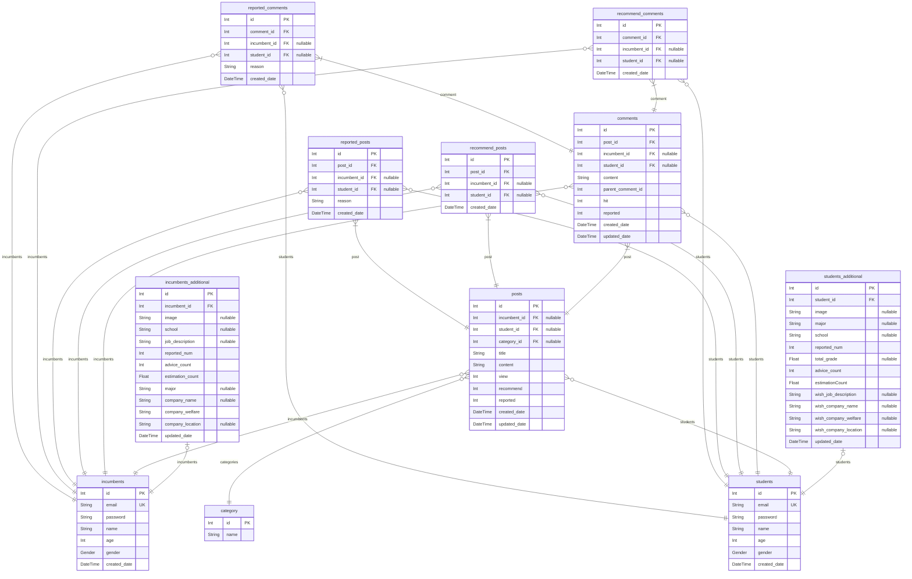

# DongA
> Generated by [`prisma-markdown`](https://github.com/samchon/prisma-markdown)

- [default](#default)

## default

### `incumbents`

**Properties**
  - `id`: 
  - `email`: 
  - `password`: 
  - `name`: 
  - `age`: 
  - `gender`: 
  - `created_date`: 

### `incumbents_additional`

**Properties**
  - `id`: 
  - `incumbent_id`: 
  - `image`: 
  - `school`: 
  - `job_description`: 
  - `reported_num`: 
  - `advice_count`: 
  - `estimation_count`: 
  - `major`: 
  - `company_name`: 
  - `company_welfare`: 
  - `company_location`: 
  - `updated_date`: 

### `students`

**Properties**
  - `id`: 
  - `email`: 
  - `password`: 
  - `name`: 
  - `age`: 
  - `gender`: 
  - `created_date`: 

### `students_additional`

**Properties**
  - `id`: 
  - `student_id`: 
  - `image`: 
  - `major`: 
  - `school`: 
  - `reported_num`: 
  - `total_grade`: 
  - `advice_count`: 
  - `estimationCount`: 
  - `wish_job_description`: 
  - `wish_company_name`: 
  - `wish_company_welfare`: 
  - `wish_company_location`: 
  - `updated_date`: 

### `category`

**Properties**
  - `id`: 
  - `name`: 

### `posts`

**Properties**
  - `id`: 
  - `incumbent_id`: 
  - `student_id`: 
  - `category_id`: 
  - `title`: 
  - `content`: 
  - `view`: 
  - `recommend`: 
  - `reported`: 
  - `created_date`: 
  - `updated_date`: 

### `comments`

**Properties**
  - `id`: 
  - `post_id`: 
  - `incumbent_id`: 
  - `student_id`: 
  - `content`: 
  - `parent_comment_id`: 
  - `hit`: 
  - `reported`: 
  - `created_date`: 
  - `updated_date`: 

### `recommend_posts`

**Properties**
  - `id`: 
  - `post_id`: 
  - `incumbent_id`: 
  - `student_id`: 
  - `created_date`: 

### `reported_posts`

**Properties**
  - `id`: 
  - `post_id`: 
  - `incumbent_id`: 
  - `student_id`: 
  - `reason`: 
  - `created_date`: 

### `recommend_comments`

**Properties**
  - `id`: 
  - `comment_id`: 
  - `incumbent_id`: 
  - `student_id`: 
  - `created_date`: 

### `reported_comments`

**Properties**
  - `id`: 
  - `comment_id`: 
  - `incumbent_id`: 
  - `student_id`: 
  - `reason`: 
  - `created_date`: 