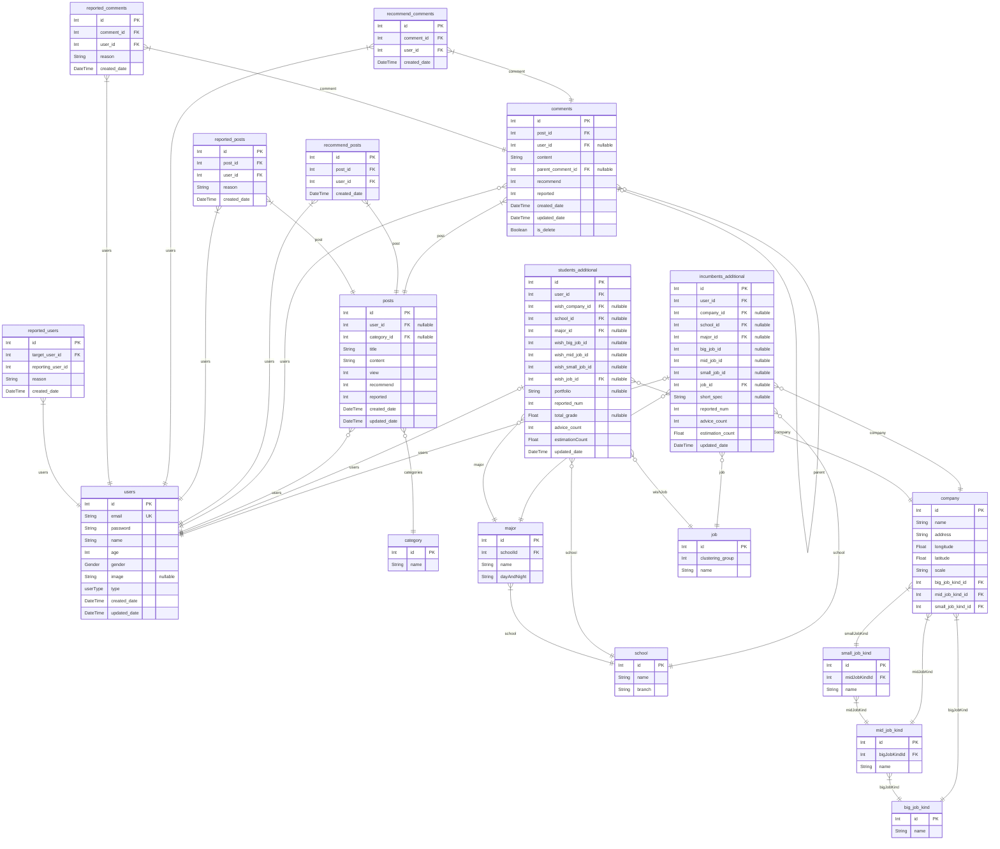

# DongA
> Generated by [`prisma-markdown`](https://github.com/samchon/prisma-markdown)

- [default](#default)

## default

### `users`

**Properties**
  - `id`: 
  - `email`: 
  - `password`: 
  - `name`: 
  - `age`: 
  - `gender`: 
  - `image`: 
  - `type`: 
  - `created_date`: 
  - `updated_date`: 

### `incumbents_additional`

**Properties**
  - `id`: 
  - `user_id`: 
  - `company_id`: 
  - `school_id`: 
  - `major_id`: 
  - `big_job_id`: 
  - `mid_job_id`: 
  - `small_job_id`: 
  - `job_id`: 
  - `short_spec`: 
  - `reported_num`: 
  - `advice_count`: 
  - `estimation_count`: 
  - `updated_date`: 

### `students_additional`

**Properties**
  - `id`: 
  - `user_id`: 
  - `wish_company_id`: 
  - `school_id`: 
  - `major_id`: 
  - `wish_big_job_id`: 
  - `wish_mid_job_id`: 
  - `wish_small_job_id`: 
  - `wish_job_id`: 
  - `portfolio`: 
  - `reported_num`: 
  - `total_grade`: 
  - `advice_count`: 
  - `estimationCount`: 
  - `updated_date`: 

### `category`

**Properties**
  - `id`: 
  - `name`: 

### `posts`

**Properties**
  - `id`: 
  - `user_id`: 
  - `category_id`: 
  - `title`: 
  - `content`: 
  - `view`: 
  - `recommend`: 
  - `reported`: 
  - `created_date`: 
  - `updated_date`: 

### `comments`

**Properties**
  - `id`: 
  - `post_id`: 
  - `user_id`: 
  - `content`: 
  - `parent_comment_id`: 
  - `recommend`: 
  - `reported`: 
  - `created_date`: 
  - `updated_date`: 
  - `is_delete`: 

### `recommend_posts`

**Properties**
  - `id`: 
  - `post_id`: 
  - `user_id`: 
  - `created_date`: 

### `reported_posts`

**Properties**
  - `id`: 
  - `post_id`: 
  - `user_id`: 
  - `reason`: 
  - `created_date`: 

### `recommend_comments`

**Properties**
  - `id`: 
  - `comment_id`: 
  - `user_id`: 
  - `created_date`: 

### `reported_comments`

**Properties**
  - `id`: 
  - `comment_id`: 
  - `user_id`: 
  - `reason`: 
  - `created_date`: 

### `reported_users`

**Properties**
  - `id`: 
  - `target_user_id`: 
  - `reporting_user_id`: 
  - `reason`: 
  - `created_date`: 

### `company`

**Properties**
  - `id`: 
  - `name`: 
  - `address`: 
  - `longitude`: 
  - `latitude`: 
  - `scale`: 
  - `big_job_kind_id`: 
  - `mid_job_kind_id`: 
  - `small_job_kind_id`: 

### `school`

**Properties**
  - `id`: 
  - `name`: 
  - `branch`: 

### `major`

**Properties**
  - `id`: 
  - `schoolId`: 
  - `name`: 
  - `dayAndNight`: 

### `big_job_kind`

**Properties**
  - `id`: 
  - `name`: 

### `mid_job_kind`

**Properties**
  - `id`: 
  - `bigJobKindId`: 
  - `name`: 

### `small_job_kind`

**Properties**
  - `id`: 
  - `midJobKindId`: 
  - `name`: 

### `job`

**Properties**
  - `id`: 
  - `clustering_group`: 
  - `name`: 