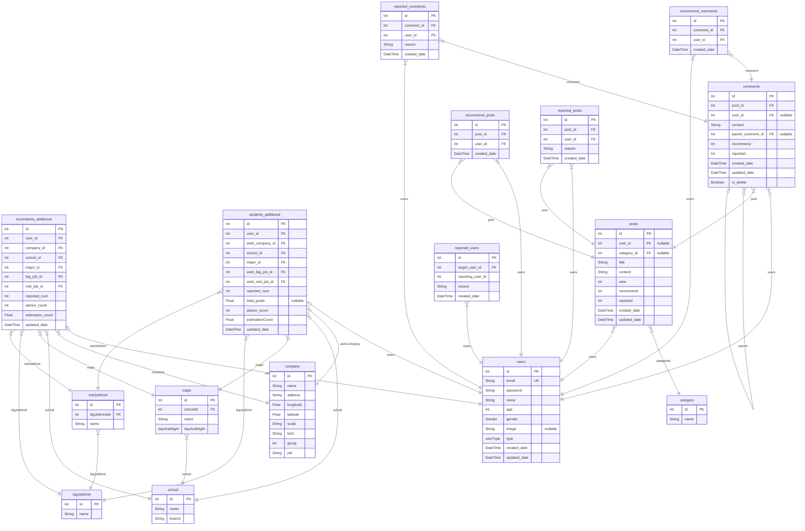

# 캡스톤디자인 Friends-across-the-street팀 server

## Project Architecture

## Project ERD

> Generated by [`prisma-markdown`](https://github.com/samchon/prisma-markdown)

```mermaid
erDiagram
"users" {
    Int id PK
    String email UK
    String password
    String name
    Int age
    Gender gender
    String image "nullable"
    userType type
    DateTime created_date
    DateTime updated_date
}
"incumbents_additional" {
    Int id PK
    Int user_id FK
    Int company_id FK
    Int school_id FK
    Int major_id FK
    Int big_job_id FK
    Int mid_job_id FK
    Int reported_num
    Int advice_count
    Float estimation_count
    DateTime updated_date
}
"students_additional" {
    Int id PK
    Int user_id FK
    Int wish_company_id FK
    Int school_id FK
    Int major_id FK
    Int wish_big_job_id FK
    Int wish_mid_job_id FK
    Int reported_num
    Float total_grade "nullable"
    Int advice_count
    Float estimationCount
    DateTime updated_date
}
"category" {
    Int id PK
    String name
}
"posts" {
    Int id PK
    Int user_id FK "nullable"
    Int category_id FK "nullable"
    String title
    String content
    Int view
    Int recommend
    Int reported
    DateTime created_date
    DateTime updated_date
}
"comments" {
    Int id PK
    Int post_id FK
    Int user_id FK "nullable"
    String content
    Int parent_comment_id FK "nullable"
    Int recommend
    Int reported
    DateTime created_date
    DateTime updated_date
    Boolean is_delete
}
"recommend_posts" {
    Int id PK
    Int post_id FK
    Int user_id FK
    DateTime created_date
}
"reported_posts" {
    Int id PK
    Int post_id FK
    Int user_id FK
    String reason
    DateTime created_date
}
"recommend_comments" {
    Int id PK
    Int comment_id FK
    Int user_id FK
    DateTime created_date
}
"reported_comments" {
    Int id PK
    Int comment_id FK
    Int user_id FK
    String reason
    DateTime created_date
}
"reported_users" {
    Int id PK
    Int target_user_id FK
    Int reporting_user_id
    String reason
    DateTime created_date
}
"company" {
    Int id PK
    String name
    String address
    Float longitude
    Float latitude
    String scale
    String kind
    Int group
    String job
}
"school" {
    Int id PK
    String name
    String branch
}
"major" {
    Int id PK
    Int schoolId FK
    String name
    dayAndNight dayAndNight
}
"bigJobKind" {
    Int id PK
    String name
}
"midJobKind" {
    Int id PK
    Int bigJobKindId FK
    String name
}
"incumbents_additional" |o--|| "users" : users
"incumbents_additional" }|--|| "company" : company
"incumbents_additional" }|--|| "school" : school
"incumbents_additional" }|--|| "major" : major
"incumbents_additional" }|--|| "bigJobKind" : bigJobKind
"incumbents_additional" }|--|| "midJobKind" : midJobKind
"students_additional" |o--|| "users" : users
"students_additional" }|--|| "company" : wishCompany
"students_additional" }|--|| "school" : school
"students_additional" }|--|| "major" : major
"students_additional" }|--|| "bigJobKind" : bigJobKind
"students_additional" }|--|| "midJobKind" : midJobKind
"posts" }o--|| "category" : categories
"posts" }o--|| "users" : users
"comments" }o--|| "users" : users
"comments" }|--|| "posts" : post
"comments" }o--o| "comments" : parent
"recommend_posts" }|--|| "users" : users
"recommend_posts" }|--|| "posts" : post
"reported_posts" }|--|| "users" : users
"reported_posts" }|--|| "posts" : post
"recommend_comments" }|--|| "comments" : comment
"recommend_comments" }|--|| "users" : users
"reported_comments" }|--|| "comments" : comment
"reported_comments" }|--|| "users" : users
"reported_users" }|--|| "users" : users
"major" }|--|| "school" : school
"midJobKind" }|--|| "bigJobKind" : bigJobKind
```
