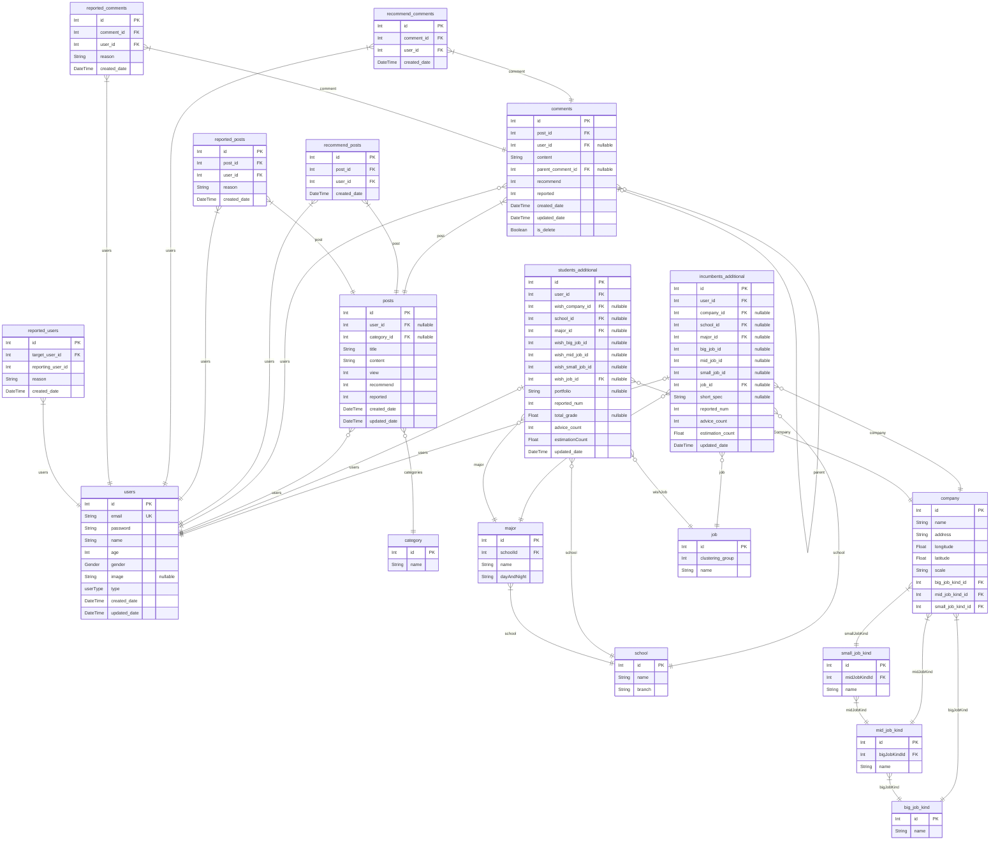

# 캡스톤디자인 Friends-across-the-street팀 server

## Architecture

## ERD

```mermaid
erDiagram
"users" {
    Int id PK
    String email UK
    String password
    String name
    Int age
    Gender gender
    String image "nullable"
    userType type
    DateTime created_date
    DateTime updated_date
}
"incumbents_additional" {
    Int id PK
    Int user_id FK
    Int company_id FK "nullable"
    Int school_id FK "nullable"
    Int major_id FK "nullable"
    Int big_job_id "nullable"
    Int mid_job_id "nullable"
    Int small_job_id "nullable"
    Int job_id FK "nullable"
    String short_spec "nullable"
    Int reported_num
    Int advice_count
    Float estimation_count
    DateTime updated_date
}
"students_additional" {
    Int id PK
    Int user_id FK
    Int wish_company_id FK "nullable"
    Int school_id FK "nullable"
    Int major_id FK "nullable"
    Int wish_big_job_id "nullable"
    Int wish_mid_job_id "nullable"
    Int wish_small_job_id "nullable"
    Int wish_job_id FK "nullable"
    String portfolio "nullable"
    Int reported_num
    Float total_grade "nullable"
    Int advice_count
    Float estimationCount
    DateTime updated_date
}
"category" {
    Int id PK
    String name
}
"posts" {
    Int id PK
    Int user_id FK "nullable"
    Int category_id FK "nullable"
    String title
    String content
    Int view
    Int recommend
    Int reported
    DateTime created_date
    DateTime updated_date
}
"comments" {
    Int id PK
    Int post_id FK
    Int user_id FK "nullable"
    String content
    Int parent_comment_id FK "nullable"
    Int recommend
    Int reported
    DateTime created_date
    DateTime updated_date
    Boolean is_delete
}
"recommend_posts" {
    Int id PK
    Int post_id FK
    Int user_id FK
    DateTime created_date
}
"reported_posts" {
    Int id PK
    Int post_id FK
    Int user_id FK
    String reason
    DateTime created_date
}
"recommend_comments" {
    Int id PK
    Int comment_id FK
    Int user_id FK
    DateTime created_date
}
"reported_comments" {
    Int id PK
    Int comment_id FK
    Int user_id FK
    String reason
    DateTime created_date
}
"reported_users" {
    Int id PK
    Int target_user_id FK
    Int reporting_user_id
    String reason
    DateTime created_date
}
"company" {
    Int id PK
    String name
    String address
    Float longitude
    Float latitude
    String scale
    Int big_job_kind_id FK
    Int mid_job_kind_id FK
    Int small_job_kind_id FK
}
"school" {
    Int id PK
    String name
    String branch
}
"major" {
    Int id PK
    Int schoolId FK
    String name
    String dayAndNight
}
"big_job_kind" {
    Int id PK
    String name
}
"mid_job_kind" {
    Int id PK
    Int bigJobKindId FK
    String name
}
"small_job_kind" {
    Int id PK
    Int midJobKindId FK
    String name
}
"job" {
    Int id PK
    Int clustering_group
    String name
}
"incumbents_additional" |o--|| "users" : users
"incumbents_additional" }o--|| "company" : company
"incumbents_additional" }o--|| "school" : school
"incumbents_additional" }o--|| "major" : major
"incumbents_additional" }o--|| "job" : job
"students_additional" |o--|| "users" : users
"students_additional" }o--|| "company" : wishCompany
"students_additional" }o--|| "school" : school
"students_additional" }o--|| "major" : major
"students_additional" }o--|| "job" : wishJob
"posts" }o--|| "category" : categories
"posts" }o--|| "users" : users
"comments" }o--|| "users" : users
"comments" }|--|| "posts" : post
"comments" }o--o| "comments" : parent
"recommend_posts" }|--|| "users" : users
"recommend_posts" }|--|| "posts" : post
"reported_posts" }|--|| "users" : users
"reported_posts" }|--|| "posts" : post
"recommend_comments" }|--|| "comments" : comment
"recommend_comments" }|--|| "users" : users
"reported_comments" }|--|| "comments" : comment
"reported_comments" }|--|| "users" : users
"reported_users" }|--|| "users" : users
"company" }|--|| "big_job_kind" : bigJobKind
"company" }|--|| "mid_job_kind" : midJobKind
"company" }|--|| "small_job_kind" : smallJobKind
"major" }|--|| "school" : school
"mid_job_kind" }|--|| "big_job_kind" : bigJobKind
"small_job_kind" }|--|| "mid_job_kind" : midJobKind
```

## API

