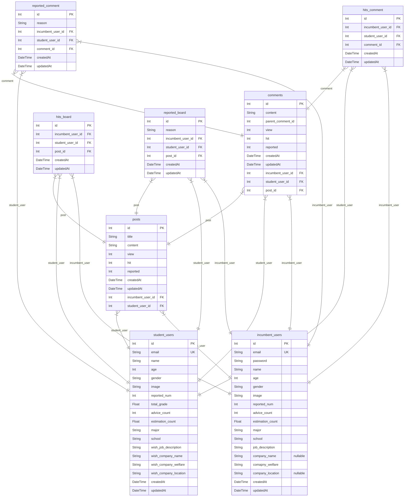

# DongA

> Generated by [`prisma-markdown`](https://github.com/samchon/prisma-markdown)

- [default](#default)

## default

### `incumbent_users`

**Properties**

- `id`: 현직자 User ID
- `email`: Email(소셜로그인 Email 정보)
- `password`: 가입시 비밀번호(hash)
- `name`: 실명
- `age`: 나이
- `gender`: 성별
- `image`: 사용자 설정 Image
- `reported_num`: 신고 당한 횟수
- `advice_count`: 끝마친 상담 횟수
- `estimation_count`: 학생 → 현직자 평가 점수 (1~10점, Default = 5점)
- `major`: 출신 학교 졸업 전공
- `school`: 출신 학교
- `job_description`: 세부전공(ex, Backend / Frontend / QA등등)
- `company_name`: 현재 회사 이름
- `comapny_welfare`: 현재 회사 복지
- `company_location`: 현재 회사 위치
- `createdAt`: 사용자 가입 날짜
- `updatedAt`: 사용자 정보 변경 날짜

### `student_users`

**Properties**

- `id`: 학생 User ID
- `email`: Email(소셜로그인 Email 정보)
- `name`: 실명
- `age`: 나이
- `gender`: 성별
- `image`: 사용자 설정 Image
- `reported_num`: 신고 당한 횟수
- `total_grade`: 현재 학점(최종 학점)
- `advice_count`: 상담 진행 횟수
- `estimation_count`: 현직자 → 학생 평가 점수 (1~10점, Default = 5점)
- `major`: 현재 학교 전공
- `school`: 현재 학교
- `wish_job_description`: 희망 세부전공
- `wish_company_name`: 희망 회사 이름
- `wish_company_welfare`: 희망 회사 복지
- `wish_company_location`: 희망 회사 위치
- `createdAt`: 사용자 가입 날짜
- `updatedAt`: 사용자 정보 변경 날짜

### `posts`

**Properties**

- `id`: 게시글 고유 ID
- `title`: 제목
- `content`: 내용
- `view`: 조회수
- `hit`: 추천수
- `reported`: 신고받은 횟수
- `createdAt`: 게시글 작성 날짜
- `updatedAt`: 게시글 정보 변경 날짜(대부분의 경우 조회된 경우 or 추천된 경우)
- `incumbent_user_id`: 게시글 작성자 id(만약 학생이 작성한 경우 0으로 기입)
- `student_user_id`: 게시글 작성자 id(만약 현직자가 작성한 경우 0으로 기입)

### `comments`

**Properties**

- `id`: 댓글 고유 ID
- `content`: 내용
- `parent_comment_id`: 대댓글 ID(만약 댓글일 경우는 0으로 기입)
- `view`: 조회수
- `hit`: 추천수
- `reported`: 신고받은 횟수
- `createdAt`: 댓글 작성 날짜
- `updatedAt`: 댓글 정보 변경 날짜(대부분의 경우 조회된 경우 or 추천된 경우)
- `incumbent_user_id`: 게시글 작성자 id(만약 학생이 작성한 경우 0으로 기입)
- `student_user_id`: 게시글 작성자 id(만약 현직자가 작성한 경우 0으로 기입)
- `post_id`: 해당 댓글 상위 게시글의 id

### `hits_board`

**Properties**

- `id`: 게시글 추천 고유 ID
- `incumbent_user_id`: 추천자 ID(만약 학생이 작성한 경우 0으로 기입)
- `student_user_id`: 추천자 ID(만약 현직자가 작성한 경우 0으로 기입)
- `post_id`: 추천받은 게시글의 ID
- `createdAt`: 게시글 추천 날짜

### `reported_board`

**Properties**

- `id`: 게시글 신고 고유 ID
- `reason`: 게시글 신고 이유
- `incumbent_user_id`: 신고자ID(만약 학생이 작성한 경우 0으로 기입)
- `student_user_id`: 신고자ID(만약 현직자가 작성한 경우 0으로 기입)
- `post_id`: 신고받은 게시글의 ID
- `createdAt`: 게시글 신고 날짜

### `hits_comment`

**Properties**

- `id`: 댓글 추천 고유 ID
- `incumbent_user_id`: 추천자 id(만약 학생이 작성한 경우 0으로 기입)
- `student_user_id`: 추천자 id(만약 현직자가 작성한 경우 0으로 기입)
- `comment_id`: 추천받은 댓글의 ID
- `createdAt`: 댓글 추천 날짜

### `reported_comment`

**Properties**

- `id`: 댓글 신고 고유 ID
- `reason`: 댓글 신고 이유
- `incumbent_user_id`: 신고자ID(만약 학생이 작성한 경우 0으로 기입)
- `student_user_id`: 신고자ID(만약 현직자가 작성한 경우 0으로 기입)
- `comment_id`: 신고받은 댓글의 ID
- `createdAt`: 댓글 신고 날짜
